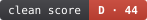

# fixearly



> 우리 엔진도 **B**입니다. 2천 줄 단일 파일이라서요. 툴은 자기한테도 안 봐줍니다 — 그게 요점입니다. ([랜딩](https://fixearly.m1k.app))

**코드가 아니라 그 코드를 다음에 고칠 때 드는 비용을 잰다.** JS·TS 전용 · 정적 분석 · 100% 로컬 · LLM 0 · SSS ~ E 등급.

```bash
npx fixearly --dir=src --report
```

명령 한 줄, 설정 제로. 코드는 컴퓨터 밖으로 한 발짝도 안 나간다. `--report`는 **한 장짜리 HTML**을 뽑는다 —
같은 체급 오픈소스 안에서 내 위치, 축별 좌표, **무엇부터 고칠지(파일:줄)**, 그리고 각 항목을 코딩 에이전트에 그대로
붙여넣을 **작업 지시문**까지.

```
등급: B (73점) — 함수 11,000개, cog15+ 293개, 중복 5.5%, 200줄+ 173개
지난 측정(2026-07-20 09:00) 대비: C 69 → B 73 (+4점)
✓ 리포트 → fixearly-report.html
```

---

## 유명 오픈소스 74개, 실제 점수

같은 자로, 예외 없이 채점했다. **2026-07-31 · 채점 규칙 v12 기준 전량 재측정.** 전체는 [랜딩](https://fixearly.m1k.app)에.

| 프로젝트 | 등급 | 점수 | 핵심 지표 |
|----------|------|------|-----------|
| mitt | **SSS** | 100 | 1파일 · 75줄 · 중복 0% |
| rxjs | **SSS** | 99 | 188파일 · 6,536줄 · 중복 6.5% |
| execa | **SSS** | 98 | 103파일 · 5,726줄 · 중복 0.7% |
| adonisjs | **SS** | 93 | 19파일 · 1,228줄 · 중복 5.3% |
| cypress | **SS** | 93 | 228파일 · 26,700줄 · 중복 1% |
| express | **SS** | 93 | 6파일 · 1,137줄 · 중복 0% |
| jotai | **SS** | 93 | 31파일 · 3,036줄 · 중복 1.8% |
| nestjs | **SS** | 93 | 483파일 · 31,729줄 · 중복 7.3% |
| mongoose | **D+** | 49 | 긴 함수 6.1% · 중복 5.5% |
| vue | **D** | 45 | 긴 함수 8.1% · 중복 1.1% |
| react | **D** | 45 | 긴 함수 8.8% · 중복 12.6% |
| payload | **D** | 36 | 긴 함수 15.4% · 중복 5.3% |
| elysia | **E+** | 27 | 긴 함수 8.7% · 중복 15.2% |

> **react가 D(45점)다.** 이건 "나쁜 라이브러리"라는 뜻이 아니다. 성능과 번들 크기를 위해 추상화를 일부러 포기한 코드
> (모노모픽 메가함수, 빌드 타깃별 손복제)를 이 축이 깎기 때문이다. 실제로 `react-devtools`를 제외하면 점수가 **더** 내려간다 —
> 툴링이 완충재였다. v7 에선 E+ 28점이었는데 v12 에서 45점이 됐다. 점수가 오른 건 react 가 변해서가 아니라 **자가 바뀌어서다** —
> 파일 크기 항이 코퍼스 p90 훨씬 전에 만점 감점에 닿고 있던 걸 고쳤다(react 는 파일 평균 199줄). **점수는 판결이 아니라 측정이다.**
> 무엇을 재는지 전부 아래에 공개한다.

---

## 무엇을 재는가

### 채점축 6개 (등급을 만든다 · 캡 기준 배점 · 합 87)

| 축 | 배점 | 설명 |
|----|------|------|
| **인지 복잡도** | 37 | SonarSource `S3776` 스펙 준수(정본값 일치 검증). cog15+·cog25+ 비율 + p90 + 상위 10개 평균. |
| **함수 길이** | 23 | 한 번에 읽어야 하는 양. 중첩 함수·주석을 뺀 *자기 코드 줄* 기준, 40줄 초과(JSX 60줄) 비율 + p90 + **상위 10개 평균**. 파일을 쪼개도 안 변하므로 조작이 안 된다. |
| **중복** | 9 | 토큰 단위 복붙 밀도. 70개 실측에서 점수와 상관 −0.11(v7 코퍼스)이라 배점을 16→9로 낮췄다 — 대부분엔 0점, 소수에게만 큰 항목. |
| **파일 크기** | 8 | 평균 줄 수 + 대형 파일 비중. **27→8로 강등했다**: 같은 코드를 6파일로 쪼개기만 해도 옛 공식이 +27점을 줬다. |
| **순차 I/O** | 5 | 루프 안 행마다 조회(N+1) + 서로 안 엮인 `await` 를 줄 세우는 것. 같은 결함이라 한 축이다. 37곳 재측정에서 기존 점수와 **rho=−0.18** 로 독립이고 **11곳(30%)**에서 발동한다. **v8 은 N+1 만 넣었고 실패했다** — 37곳 중 1곳에서만 발동했고 그 값조차 캡에 못 닿아, 축이 저장소 하나만 건드렸다. 승격 근거로 쓴 표본 12곳이 백엔드 위주였는데 코퍼스는 라이브러리 쪽으로 쏠려 있었다. **3곳 미만은 안 센다**(재시도·커서 페이지네이션은 순차가 맞다). 유예 3.0/1000파일, 기울기 0.185(캡은 30.0에서 닿는다 — 37곳 중 3곳). 캡 5: 오탐이 남는다. |
| **O(n²)** | 5 | 행 루프 안 바깥 배열 조회. `.find/.some/.filter/.findIndex` 와 **멤버십 조회(`includes`/`indexOf`)** — 후자는 v12에서 넣었다. 넣기만 하면 문자열 연산이 쏟아지므로(`url.includes('/')`) 수신자가 **배열이라는 증거**가 있을 때만 센다. **이 도구가 PR 을 가장 많이 만든 축이다**(11건 제출·머지 1·승인 1). 테스트·프론트 구역, 정적 외곽, 루프 안 I/O, n 이 잘린 자리, **함수 안 작은 고정 목록**을 제외한 candidates 만 세고, **3곳 미만은 면제**한다. 캡 5: 판정 난 O(n²) PR 6건 중 4건이 닫혔다. **10k줄당**으로 재고 유예 1.5(=코퍼스 중앙) · 기울기 1.30(캡이 p90=5.34에서). 74곳 중 34곳 감점·6곳 만점·기존 점수와 rho=−0.31. |

**상위 10개 평균을 쓰는 이유**: 최악값 1개를 재면 "가장 나쁜 하나만 고치고 끝"이 최적 전략이 된다(실측: 하나 고치면 +0.99점, 그 다음부터 ~0). 상위 10개 평균은 10개를 실제로 줄여야 계속 내려간다.

### 진단 19종 (등급을 건드리지 않는다 · 파일:줄만 짚는다)

**성능 6** — `순환 의존` · `루프 안 파일읽기` · `렌더 인질` · `루프 불변 인덱스` ·
`스프레드 누적 O(n²)` · `루프 안 new RegExp`
**정확성 버그 5** — `floating promise` · `await in forEach` · `공유 참조 fill` · `숫자 정렬(비교자 없는 sort)` · `전역 정규식 상태`
**타입 위생 4** — `any 남용` · `as any 단언` · `non-null (!)` · `@ts-ignore`
**위생 4** — `빈 catch` · `배열에 for...in` · `쓰기만 하는 컬렉션` · `데드코드(--dead, knip)`

왜 점수에서 뺐나: 대부분은 **n이 실제로 큰지** 사람이 확인해야 의미가 있다. 사람 판단이 필요한 축을 자동 채점에 넣으면
작은 저장소가 통째로 무너진다(파일 1개·사이트 2곳 = 만렙 감점). 그래서 "고칠 목록"으로만 낸다.

**축이 되려면 채점도 되고 PR 도 나와야 한다.** 채점만 되면 잔소리고, PR 만 되면 리포트가 안 움직인다.
v10에서 `O(n²) 배열 조회`를 올린 건 그 기준 때문이다 — PR 을 11건 만들어 놓고 등급은 안 건드리고 있었다.

**단, 이건 채점축 얘기다. 진단에는 PR 가능성을 요구하지 않는다.** 소비자가 둘이라서다 —
남의 저장소로 나가는 PR 은 "받아줄 만한가"가 걸리지만, **자기 저장소 자가검진에는 그 게이트가
없다.** "너무 사소해서 외부에서는 거절될 것"이라도 내 코드에서 찾으면 그냥 고치는 종류라면
규칙으로 들고 있는 게 맞다. 진단의 문턱은 대신 **오탐률**과 **고치면 실제로 나아지는가** 둘이다.

순차 I/O만 예외로 채점축에 올렸다: **밀도**(1000파일당)로 재고 **3곳 미만은 세지 않아** 작은 저장소가
사이트 한둘로 무너지지 않는다. 그래도 캡을 5로 묶은 이유는 같다 — 오탐이 남는다.

**결합도(순환 의존)를 새로 넣었다 — 진단으로 먼저.** 다른 축은 전부 "읽기 어려운가"를 잰다. 그런데 고치는
비용은 (이해 난이도) x (몇 군데를 같이 고쳐야 하나)다. 두 번째 항이 통째로 빠져 있었다. 순환에 묶인 모듈은
따로 읽을 수도, 테스트할 수도, 교체할 수도 없다. 타입 전용 import 는 런타임 간선이 아니라 세지 않는다 —
35곳 실측에서 전체 순환의 **37%가 타입 전용**이었다.

채점축으로는 아직 안 올린다. 35곳에서 기존 점수와 rho=−0.24 로 대체로 독립이지만, 가장 많이 발동하는
**앱 8곳 안에서는 rho=−0.67** 로 절반쯤 겹친다. 표본이 얇고(앱 n=8 · 당시 코퍼스 70개 중 35개만 재측정 가능했다 — 지금은 74곳 전량 가능하니 재검증할 자리다),
6번째 캡을 더하면 합이 82→88 로 올라 발표된 점수가 전부 움직인다. 그 결정은 전량 재측정 뒤에 한다.

**복잡도 축과 함수 길이 축은 상당히 겹친다 — 알고 두는 것이다.** 69곳 원지표 상관:
`복잡도 상위10 ↔ 길이 상위10` **+0.88**, `복잡도 최대 ↔ 길이 최대` +0.78, `cog15+ ↔ 40줄+` +0.70.
감점 기준으로도 0.62~0.79다. 둘이 캡 87 중 60을 쓴다.

그런데 항을 하나씩 빼고 순위를 다시 매겨보면 `길이 p90`(rho 0.9963) · `길이 상위10`(0.9913) ·
`복잡도 상위10`(0.9928)은 **코퍼스 순위를 거의 안 움직인다.** 그래도 안 걷어낸다 — 이 항들은 순위가 아니라
**게이밍 기울기**를 위해 있다. 최악값 하나만 재면 "제일 나쁜 하나 고치고 끝"이 최적 전략이 되는데,
상위 10개 평균은 미분값이 0이 되지 않아 10개를 실제로 줄여야 계속 내려간다. 정적인 코퍼스 순위로는
그 효과를 측정할 수 없다. 중복이라는 사실은 여기 적어두고 유지한다.

반대로 `중복`은 캡이 9뿐인데 순위 영향은 두 번째로 크다(rho 0.9509). 다른 항과 상관이 ≤0.10으로
유일하게 완전히 독립이기 때문이다.

**새 축 후보 4종도 검토했다가 전부 물렸다** (2026-07-31, 37곳 실측 · `tools/axis-probe.mjs`).
넷 다 통계 기준(독립성·변별력·규모 중립)은 통과했다. 떨어진 건 **지점이 주장을 뒷받침하는가**와
**기계적 PR 이 되는가** 쪽이다.

- `동기 I/O`(이벤트 루프 블로킹) — 245곳이 나왔지만 서버 경로는 **24곳(6/37)** 뿐이었다.
  나머지는 vite 의존성 최적화·vitest 스캐폴딩·nuxt 빌드·storybook builder였고, next.js 61곳은
  `compiled/` 아래 **번들된 벤더 코드**였다. 거기선 동기 I/O 가 정상이다.
- `무제한 Promise.all 팬아웃` — 수정에 동시성 제한기가 필요해 의존성 추가와 설계 결정이 따른다.
- `중복 await` — 탐지가 호출 **텍스트**를 비교해서, 값만 바뀌는 호출을 중복으로 센다
  (outline 마이그레이션: `tableName` 을 재대입하며 같은 텍스트 4회). 분기별 호출도 못 가른다.
- `JSON.parse(JSON.stringify())` — `structuredClone` 은 JSON 왕복과 동작이 다르다(Date·RegExp·Map).
  행동 보존이 아니라 PR 로 내기 위험하고, 신호도 약하다(10/37).

**패턴이 반복된다: 통계는 쉽게 통과하고, 실제 지점을 열어보면 죽는다.** 축을 늘리는 것보다
지금 6축의 오탐을 줄이는 쪽이 수익률이 높다 — 실제로 손검증 두 번에 O(n²) 13%, 순차 I/O 14%의
오탐을 걷어냈다.

**승격을 검토했다가 물린 둘** (37곳 실측):

- `floating promise` — 발동 12/37, 점수와 rho=+0.01 로 통계는 이상적이다. 그런데 `void foo()` 한 단어로
  탐지를 피할 수 있고, 그건 ESLint `no-floating-promises` 가 **공식 권장하는 opt-out** 이다. 채점축이 되면
  "린트 탈출구를 아는가"를 재게 된다 — 버려진 에러는 그대로인데 점수만 오른다.
- `스프레드 누적` — 발동 18/37, 점수와 rho=−0.30. 이건 그 자체가 O(n²) 라서 위와 같은 이유로 걸린다:
  **심각도가 실행 시점의 n 에 달렸는데 정적 분석은 그 n 을 모른다.** 실증: `ky` 는 27파일짜리 라이브러리인데
  4곳이 전부 `utils/merge.ts` 한 파일의 HTTP 옵션 병합이다(n = 키 몇 개). 밀도로는 코퍼스 최고(148/1000파일)라
  채점하면 만점 감점을 맞는다. 밀도 정규화는 작은 저장소에서 무너진다.

검토 과정에서 `스프레드 누적` 탐지기의 재현율 구멍은 막았다 — `[...acc, x]` 만 보고 있어서 같은 O(n²)인
`acc.concat(x)` 와 `Object.assign({}, acc, …)` 를 놓쳤다. 10곳에서 38개 지점이 더 나왔다(angular 6→13,
typescript 4→10). 진단 정확도만 오르고 점수는 안 변한다.

---

## 왜 믿나 — 점수는 방어할 수 있어야 점수다

- **한계를 먼저 밝힌다** — **JS·TS 전용.** 파서가 TypeScript 컴파일러 API라 `.ts .tsx .js .jsx .mjs .cjs`만 읽는다.
  그리고 설계의 우아함·테스트·문서·보안·성능·커뮤니티는 **하나도 재지 않는다.**
- **게이밍을 측정해서 공개한다** — 같은 코드를 함수 경계에서 6파일로 기계 분할: 옛 공식 **+27점** → 지금 **+8점**(파일 축 캡).
  5줄짜리 파일 대량 투입은 분석 제외로 막힌다. **다만 "게임 불가"라고 주장하지 않는다** — 남은 구멍(파일 축 8점)을 여기 적어두는 편이 정직하다.
- **오픈소스 74개로 보정** — 유예값은 임의 임계가 아니라 코퍼스 중앙값이고, 기울기는 p90에서 캡에 닿게 잡았다. (중앙 79)
  **그 규칙을 스스로 감사한다.** 7개 감점 항 중 6개는 p90 ±5% 안에서 캡에 닿는데, `평균 파일 길이`만 145에서 닿고 있었다
  (p90은 280). 캡을 14→5로 줄이면서 나눗수를 안 고쳐 도달점이 190→145로 끌려 내려간 누락이었고, 69곳 중 29곳이
  캡에 붙어 150줄짜리와 2,000줄짜리를 구분 못 했다. v11에서 기울기를 0.03125로 맞췄다 — 캡에 붙는 곳 29 → 8.
- **체급은 코드줄로 나눈다** — 파일 수로 나누면 파일을 잘게 쪼갠 쪽이 체급만 올라간다(실측: 줄/파일이 34~2,008로 59배 차이).
- **종류별 편향을 공개한다** — 툴체인 85 · 라이브러리 85 · 프레임워크 83 · **앱 75 · 엔진·컴파일러 65.**
  엔진은 추상화를 포기하고, 앱은 화면 단위 함수가 길다. 편향이 아니라 이 축의 성격이다. 그래서 리포트는 **동종 기준선**을 함께 보여준다.
- **채점 규칙에 버전을 박았다** — 유예·기울기를 바꾸면 `v11 → v12`. 이력 비교 시 규칙이 다르면 "점수 비교 무효"를 경고한다.
- **점수가 왜 움직였는지 보여준다** — 규칙을 고치면 발표된 등급이 바뀐다. 하루에 두 판을 낸 적도 있다.
  버전만 밝히고 끝내면 어제 본 등급이 오늘 왜 다른지 알 방법이 없으므로, 보드 각 행에 **판별 궤적**을
  (`v6 28 → v7 31 → v11 45 → v12 45`) 붙이고 보드 아래에 **판마다 무엇이 바뀌었는지**를 적는다.
  점수가 오른 건 저장소가 좋아져서가 아니라 자가 바뀌어서다 — 그 구분이 보여야 한다.
- **네거티브 컨트롤 · 자기 검증 루프 · 패턴 카탈로그** — [LOOP.md](./LOOP.md) · [PATTERNS.md](./PATTERNS.md)
- **오탐 카탈로그(잡으면 안 되는 것)** — [FALSE-POSITIVES.md](./FALSE-POSITIVES.md) · 계열 17종, 엔진 가드와 `npm test` 로 묶여 있다
- **실전 검증** — 등급만 매기지 않고 진짜 고칠 것을 짚는다. 실제 OSS에 낸 PR 기록: [IMPACT.md](./IMPACT.md)
- **찾은 것을 다 내지는 않는다** — 저장소당 1건·하루 1건으로 묶어두고, 탈락 사유와 게이트 0에서
  막힌 곳까지 [PR-QUEUE.md](./PR-QUEUE.md)에 남긴다. 물량으로 보이면 저장소가 외부 PR을 닫는다.

---

## 사용법

```bash
# 리포트 한 장 (권장) — 내 위치 + 고칠 목록 + AI 지시문
npx fixearly --dir=src --report

# 점수만
npx fixearly --dir=src

# 먼저 고칠 파일 랭킹 (복잡도 × git churn)
npx fixearly --dir=src --hotspots

# 데드코드 축 추가 (knip 내장)
npx fixearly --dir=src --dead

# 모노레포에서 산출물 아닌 패키지 제외 (근거를 남길 것)
npx fixearly --dir=packages --exclude=packages/devtools,packages/examples

# README 배지
npx fixearly --dir=src --badge
```

측정할 때마다 `.fixearly-history.json`에 스냅샷이 쌓이고, 리포트에 **지난번 대비** 변화가 표시된다.
점수는 절대 위치, 변화량은 당신이 한 일이다 — 자기 이력과의 비교라 지표만 건드려서는 움직이지 않는다.

결과는 `--out` 디렉토리에 `fixearly.json`으로도 떨어진다 (CI 추이 추적용).
`--kit`을 줄 때만 옛 이름 `kit-stats.json`을 쓴다 — 기존 소비자 호환용이다.

---

## 등급

| 등급 | 점수 | | 등급 | 점수 |
|------|------|---|------|------|
| **SSS** | ≥ 97 | | **C+** | ≥ 64 |
| **SS** | ≥ 93 | | **C** | ≥ 55 |
| **S** | ≥ 90 | | **D+** | ≥ 47 |
| **A+** | ≥ 86 | | **D** | ≥ 35 |
| **A** | ≥ 80 | | **E+** | ≥ 21 |
| **B+** | ≥ 76 | | **E** | ≥ 0 |
| **B** | ≥ 70 | | | |

등급은 아래쪽을 후하게 잡았다 — 큰 서비스·앱은 구조 지표상 원래 불리하다. **E는 사실상 방치된 경우만.**

---

## 코퍼스를 다시 재는 법

채점 규칙을 바꾸면 발표된 보드가 옛 규칙 값으로 남는다. 이 도구는 "규칙이 다른 점수를 나란히 놓으면
진행도가 거짓말을 한다"를 원칙으로 내세우므로, 규칙을 올렸으면 여기까지 와야 끝이다.

```bash
BOARD_ROOT=/private/tmp/board npm run measure   # 클론 갱신 + 전량 재측정 (오래 걸린다)
BOARD_ROOT=/private/tmp/board npm run refresh   # corpus → DATA → 정적행 → 라벨 → 보드 → og
npm test                                        # 빠뜨린 게 있으면 여기서 걸린다
```

`measure` 는 이미 있는 클론도 브랜치 HEAD 로 당긴다(`BOARD_NO_PULL=1` 로 끔). 예전엔 있으면 그냥 써서
"재측정"이 옛 커밋을 다시 재는 일이 됐다.

`refresh` 가 손대는 곳이 여섯 군데인 이유는 보드에 표현이 두 벌 있기 때문이다 — JS 가 그리는
`const DATA`(사람이 보는 쪽)와 정적 `<details>` 행(JS 막힌 환경용 폴백). 하나만 고치면 새로고침에
되돌아온다. `npm test` 가 라벨·정적행 누락을 잡는다.

---

## 라이선스

MIT
